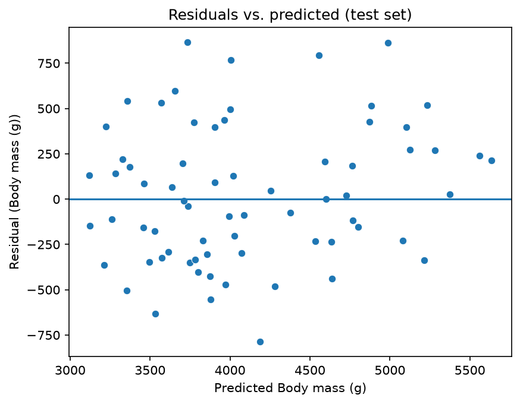
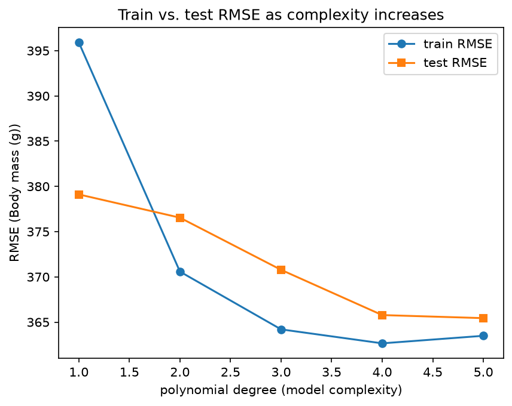

# ml-04-regression

[](https://denisecase.github.io/pro-analytics-02/workflow-b-apply-example-project/)
[](./pyproject.toml)
[](./LICENSE)

> Professional Python project: building and evaluating regression models.

## Project Description

This project builds and evaluates regression models, extending a course example
and then applying the same workflow to a custom problem.

The example predicts body_mass_g on the Seaborn penguins dataset from a single
body measurement. The Phase 4 modification extends it to a multiple regression
on two features and adds a case comparison to test whether the second feature
earns its place. The Phase 5 custom project applies the workflow to a new
dataset and is documented in docs/index.md.

The work covers:

- fitting and evaluating regression models
- using a train/test split to evaluate on unseen data
- reading regression metrics: R-squared, RMSE, and residual plots
- comparing feature cases and polynomial degree to choose a model

## Notebooks

Links:

- [ml_04_regression.ipynb](notebooks/ml_04_regression.ipynb) — the course example (penguins)
- [ml_04_regression_penguins.ipynb](notebooks/ml_04_regression_penguins.ipynb) — Phase 4: multiple regression on penguins
- [ml_04_regression_insurance.ipynb](notebooks/ml_04_regression_insurance.ipynb) — Phase 5 custom project

## Command Reference

<details>
<summary>Show command reference</summary>

### In a machine terminal (open in your `Repos` folder)

After you get a copy of this repo in your own GitHub account,
open a machine terminal in your `Repos` folder:

```shell
# Replace username with YOUR GitHub username.
git clone https://github.com/gracecode42/ml-04-regression

cd ml-04-regression
code .
```

### In a VS Code terminal

These are listed for convenience.
For best results, follow the detailed instructions in
[pro-analytics-02 guide](https://denisecase.github.io/pro-analytics-02/).

```shell
uv self update
uv python pin 3.14
uv lock --upgrade
uv sync --extra dev --extra docs --upgrade

uvx pre-commit install
uvx pre-commit autoupdate

git add -A
uvx pre-commit run --all-files
# repeat if changes were made
uvx pre-commit run --all-files

# run the example module to verify the environment (.venv/)
uv run python -m mlstudio.app_case

# run common chores
uv run ruff format .
uv run ruff check . --fix
uv run python -m pytest --cov=src --cov-report=term-missing
uv run python -m pytest
uv run python -m zensical build

# save progress
git add -A
git commit -m "update"
git push -u origin main
```

</details>

## Findings and Visuals

The two-feature model reaches an R-squared of 0.7838 on the test set, with an
RMSE of 379.113 grams. The residuals scatter around zero with no clear curve or
funnel, so nothing in the plot points to the linear form being wrong.



Sweeping polynomial degree from 1 to 5 shows test RMSE moving only about 14 grams
across the range, with training error rising at degree 5 where the fit becomes
numerically unreliable. The small gain does not justify the added complexity, so
the final model keeps degree 1.



## Project Documentation

Additional project instructions, terms, and notes:

[docs/index.md](docs/index.md)

## Citation

[CITATION.cff](./CITATION.cff)

## License

[MIT](./LICENSE)
