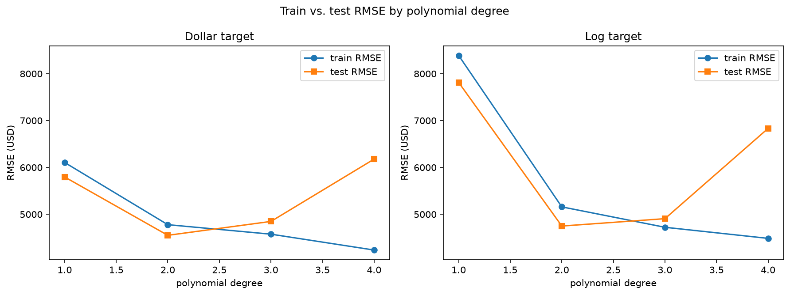

# Project Documentation

This site provides project documentation.
Use the documentation navigation to explore.

## Project Documentation Pages (docs/)

- **Home** - this documentation landing page
- [**Project Instructions**](./project-instructions.md)  - the standard project workflow
- [**Your Files**](./your-files.md) - how to copy the example and create your version
- [**Glossary**](./glossary.md) - project terms and concepts
- [**API**](./api.md) - autogenerated code documentation for the public project interface

## Phase 4. Technical Modification

For the technical modification, I added a second feature and fit a multiple
regression. The example predicts body_mass_g from flipper_length_mm alone. I
added bill_length_mm and replaced FEATURE_COL with a list, FEATURE_COLS, so the
same structure holds if more features are added. I chose it since it is a
recommended way to extend the notebook and will carry forward to the multiple
regression in the custom project.

Two changes downstream followed from it. Section 4 read only the first
coefficient and labeled it with the single feature name, so I rewrote it to log
every coefficient with its feature. Section 6 sweeps polynomial degrees to
compare model complexity, and it failed with two features, because np.polyfit
fits a single variable and the sweep was passing it a two-column array. I
replaced it with PolynomialFeatures, which expands any number of features, and
reported the term count alongside each degree.

I verified the change by rerunning the notebook and reading the log. X shape
reported (342, 2) rather than (342, 1), and the fitted model printed a
coefficient for each feature.

Adding the second feature changed the result very little. Test R-squared went
from 0.7820 to 0.7838 and RMSE from 380.695 to 379.113, an improvement of 1.6
grams in typical error. I added a case comparison to investigate. Bill length on
its own reaches an R-squared of 0.3662, so it is not uninformative, but nearly
all of what it carries about body mass overlaps with flipper length, because the
two measurements are correlated. The degree sweep told a similar story. Test
RMSE drifts down only slightly across the sweep, from 379.113 at degree 1 to
365.441 at degree 5, a change of about 14 grams. Training error falls until
degree 4, then rises at degree 5, from 362.655 to 363.488, a sign the degree 5
fit is no longer numerically reliable. Since the added degrees buy so little, I
kept degree 1, the simplest model.

I rated this moderate rather than easy. Adding one column meant edits across
three sections, more than the one-line target swap in Module 3.

## Phase 5. Custom Project

For the custom project I moved from the Seaborn penguins dataset to a real-world
problem: predicting individual medical insurance charges. The example predicted a
single numeric target from numeric body measurements. This dataset added
categorical features and a skewed target, which pushed the project past the
example's numeric-only pipeline into encoding, target transformation, polynomial
features, and regularization.

### Basis and Data

The example used the Seaborn penguins dataset, predicting body_mass_g from body
measurements. I changed to insurance.csv, 1,338 rows with no missing values, from
Kaggle (Choi, 2018), under the Open Database License. It has six features and a
continuous dollar target, which suited regression and offered a mix of numeric
and categorical columns the penguins pipeline did not have.

One limitation matters for interpretation: the data's provenance is not fully
documented, and it may not reflect real claims. The value of this project is the
method, not the specific dollar figures.

### Modeling Approach

This is supervised learning, because every row has a known target value, charges,
to learn from. It is a regression problem, because that target is a continuous
number rather than a category. A linear regression is a reasonable starting model
for a numeric target, and it also makes the model's weaknesses visible through its
residuals, which is what drove the later modeling choices.

### Target

The example target was body_mass_g, a body measurement in grams. My target is
charges, the individual medical cost billed by insurance, in dollars. The change
mattered because charges is right-skewed: the mean of 13,270 dollars sits well
above the median, pulled up by a tail of expensive cases. That skew shaped
evaluation, since a model can post a decent R-squared while missing the expensive
cases badly, and it motivated trying a log transform of the target.

### Features

The example used two numeric body measurements. I used all six available features:
age, bmi, and children, which are numeric, and sex, smoker, and region, which are
categorical. The three categorical columns were one-hot encoded into 0/1 columns,
giving eight numeric features in total. I kept all of them rather than selecting a
subset, because the dataset is small and clean and the feature comparison could
show which ones carried the weight. Smoking turned out to dominate, adding about
23,600 dollars to predicted charges.

### Evaluation and Results

I evaluated on a held-out test set using R-squared, RMSE in dollars, and residual
plots. A plain linear model reached R-squared 0.7836 and RMSE 5,796. The residual
plot was the most useful evidence: it showed the errors funneling wider as charges
rose and splitting into two groups at high charges, so the model was missing real
structure, not just imprecise.

I tried several responses. Log-transforming the target reduced the funnel in the
lower range of the residuals but raised dollar RMSE from 5,796 to 7,814, because
compressing the scale amplified the error on the largest charges. Polynomial
features at degree 2 lowered test RMSE to 4,551 and raised R-squared to 0.8666,
because the product terms let the model represent how features interact rather
than only adding their effects separately. Past degree 2 the model overfit: in
the degree sweep, training RMSE kept falling while test RMSE turned and rose. I
also tested Ridge and ElasticNet regularization. At degree 2 they changed almost
nothing, because the model was not overfitting; at degree 3, where it did
overfit, they recovered part of the loss but never beat the degree 2 model.

The result was useful rather than dramatic. The best model, degree 2 on the dollar
target, was the simplest one that captured the interaction structure, and neither
transformation nor regularization could beat it. The main limitation is the two
groups the residuals still show at high charges, which a more targeted feature
might separate better than added polynomial degree.

### Summary

I built the custom model by encoding the categorical features, fitting a linear
regression, diagnosing its residuals, and then improving it through target
transformation, polynomial features, and regularization, comparing each choice on
held-out data. The final model is the degree 2 polynomial on the dollar target,
with a test R-squared of 0.8666 and an RMSE of 4,551 dollars.

What I learned is that added machinery is only worth it where there is a problem to
solve. The log transform did not help, higher polynomial degrees overfit, and
regularization mattered only where overfitting was present. Recognizing when a
model is about as good as the data allows is part of the work, not a failure to
improve it.

Working through this project exercised the full regression workflow, from
encoding and evaluation to diagnosing residuals and deciding when added
complexity was worth its cost. The same approach applies anywhere a continuous
outcome is predicted from mixed data: predicting housing prices, estimating
medical or insurance costs, projecting energy demand, or modeling salaries from
experience and role.

